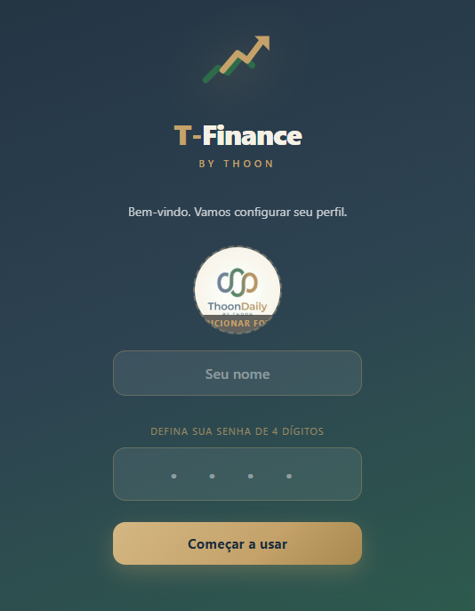

# T-Finance · by Thoon

Gestão financeira pessoal — saldo, contas fixas, metas e dívidas — direto no navegador, sem servidor, sem conta, sem rastreamento. Feito para uso no celular.

🔗 **App ao vivo:** https://thooncoder.github.io/t-finance/



## O que faz

- **Dashboard**: saldo do mês, entradas vs. saídas, previsão de fechamento, gastos por categoria.
- **Receitas fixas**: salário e extras, recorrentes ou pontuais.
- **Contas fixas**: aluguel, luz, etc. com alerta de vencimento e baixa de pagamento.
- **Histórico**: todas as movimentações do mês, com parcelamento.
- **Metas**: cálculo automático de quanto guardar por mês/semana e viabilidade.
- **DAT (Dívidas Ativas)**: área protegida por PIN para negociações de dívida (não entra no saldo).
- **Simulador de investimentos**: juros compostos com aportes mensais.
- **Multiperfil**: dados isolados por perfil, exportação/importação em JSON, exportação em CSV.

## Privacidade

100% local: todos os dados ficam em `localStorage` no seu dispositivo. Nada é enviado para nenhum servidor.

## Rodando localmente

É um app estático (HTML + CSS + JS, sem build step). Basta servir a pasta:

```bash
npx serve .
# ou
python -m http.server 8080
```

Abra `http://localhost:<porta>/` (redireciona para `t-finance.html`).

## Instalar como app (PWA)

O projeto inclui `manifest.json` e um service worker (`sw.js`) — no celular, abra o link e use "Adicionar à tela inicial" para instalar como app, com suporte offline.

## Stack

Vanilla JS, HTML e CSS puro. Sem dependências, sem build, sem framework.

---

Um produto da família **ThoonDaily**.
